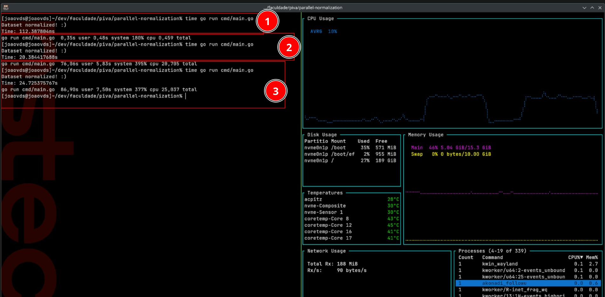
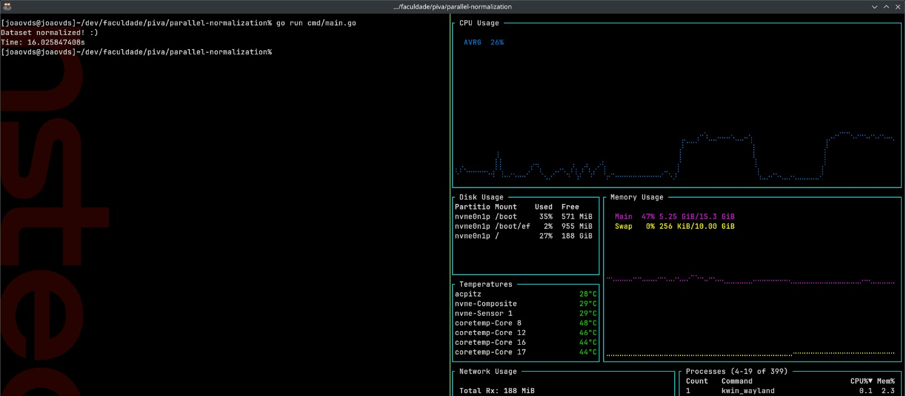
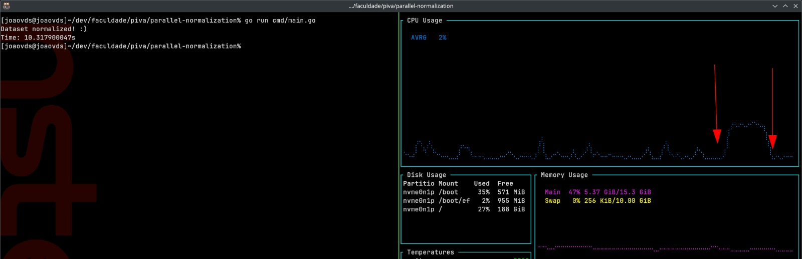
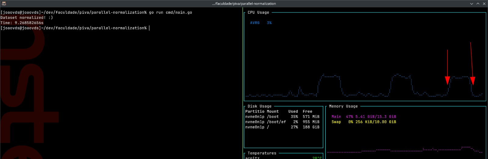
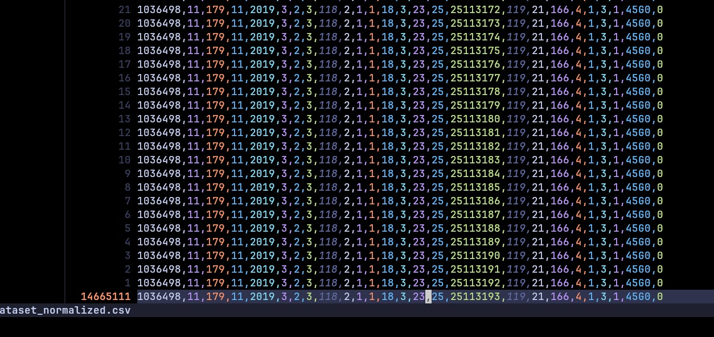
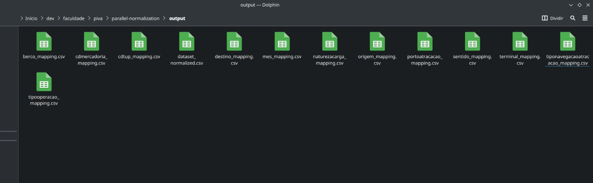

# 🚀 Parallel Normalization

A tool to normalize CSV files in parallel, using Go routines for high performance. It detects categorical columns, encodes them into integer IDs, and outputs mapping files alongside the normalized CSV data.

### ✅ Features

- Automatic detection of categorical columns based on sample data.
- Label encoding for categorical columns into integer IDs.
- Mapping files generation for each categorical column.
- Parallel batch processing for better performance with large CSV files.
- Supports large datasets with memory-efficient batch handling.

### 🏗️ Architecture & Patterns

- Language: Go
- Concurrency: Goroutines, channels, sync.WaitGroup, mutexes.
- Patterns Used:
  - Producer/Consumer (pipeline with channels).
  - Batch processing.
  - Thread-safe categorical encoding.

### 🔧 Tech Stack

**Go 1.24.0**
**Standard library (sync, time, encoding/csv, etc.)**
**No external dependencies**

### 📦 Execute

**Running Locally**

```bash
go run cmd/main.go -i file.csv
```

**Or with race condition detection:**

```bash
go run -race cmd/main.go -i file.csv
```

### ⚙️ Configuration

You can run the CSV normalization tool by providing the input file, output directory, number of samples to process, and batch size.

**Command-line arguments:**

| Flag       | Description                                                         | Default    | Required |
| ---------- | ------------------------------------------------------------------- | ---------- | -------- |
| `-i`       | Path to the **input CSV file**                                      | —          | ✅        |
| `-o`       | Path to the **output directory**                                    | `./output` | ❌        |
| `-samples` | Number of **samples (rows) to process**. Must be greater than 0    | `2`        | ❌        |
| `-batch`   | Number of **rows per batch** for processing. Must be greater than 0 | `4000`     | ❌        |

#### ✅ Example usage

```bash
go run cmd/main.go -i small_dataset.csv -o ./output -samples 10 -batch 200000
```

- The -batch flag defines how many rows are processed together in memory. Larger batches can be faster but consume more RAM.
- The output directory will be created automatically if it doesn't exist.

### 🔄 Processing Flow

The application is designed with a highly concurrent pipeline that balances CPU and memory usage efficiently. Here's how the flow works:

1. **CSV Reading (Producer)**

A dedicated ***goroutine***  reads the input CSV line by line and sends each row into a line channel. This allows reading to happen independently from processing.

2. **Batch Builder**  (Consumer & Producer)

Another ***goroutine***  listens to the line channel and groups lines into batches (based on the configured batch size).

-
  - Once a batch is full, it's sent to the batch channel for processing.
  - If the batch channel gets too full (i.e., many unprocessed batches in memory), the CSV reader automatically pauses, preventing excessive memory usage.

3. Batch Processing (Parallel Handlers)

A controller ***goroutine***  continuously listens to the batch channel.

For each incoming batch, it spawns a new ***goroutine***  responsible for handling the batch:

Normalizes the categorical columns using a thread-safe encoder.

Immediately writes the normalized batch directly to the output CSV file (stream writing).

This design ensures that the memory used by a batch is released as soon as it is processed and written.

The final output file is managed by a writer that is initialized as soon as the controller goroutine (responsible for spawning the batch handler goroutines) starts running. This writer remains open throughout the entire processing workflow, allowing each batch handler to append its normalized data directly to the output file in real time. Once all batches are fully processed and written, the writer is gracefully closed, ensuring data integrity and proper file finalization.

4. Categorical Mappings (In-Memory)

The mappings (label encodings) for each categorical column are maintained in memory during processing.

These mappings are shared across all batch handlers via synchronized structures (mutexes, one for each category column).

Only after all batches are fully processed, the final mapping files for each categorical column are written to disk.

5. Memory Management

The pipeline prevents memory explosion by backpressuring the CSV reader if too many batches are queued.

Processed batches are written immediately to the output and released from memory.

### 🐞 Known Limitations

- Currently designed for CSV files with consistent schema.

### 🗂️ Output

- Normalized CSV files in the output/ directory (Or in the directory that will be configured in main.go).
- Mapping files for each categorical column in the format: >  ***output/columnName_mapping.csv***

Each mapping file has:

| id | value |
| -------------- | --------------- |
| 1 | categorical_value1 |
| 2 | categorical_value2 |

### Example

**Input CSV:**

| idatracacao | cdtup | berco |
| --------------- | --------------- | --------------- |
|  788883| BRCDO | 101 |
| 751889 | BRBEL | BELM201 |
| 797313 | BRBEL | Quadro de Bóias |

**Output CSV (after normalization):**

| idatracacao | cdtup | berco |
| --------------- | --------------- | --------------- |
|  788883| 1 | 1 |
| 751889 | 2 | 2 |
| 797313 | 2 | 3 |

**Mapping files:**

*cdtup_mapping.csv*

| id | value |
| -------------- | --------------- |
| 1 | BRCDO |
| 2 | BRBEL |

*berco_mapping.csv*

| id | value |
| -------------- | --------------- |
| 1 | 101 |
| 2 | BELM201 |
| 3 | Quadro de Bóias |

### Performance Test

The tool was tested with two datasets: a small CSV file with 1,000 rows, and a large CSV file with 14,665,111 rows. By adjusting the batch size configuration, different execution times were observed, directly affecting the processing speed without causing memory issues. Below are some test results:

| Batch Size | Execution Time   |
| ---------- | ---------------- |
| 1,000      | \~25 seconds     |
| 4,000      | \~20 seconds     |
| 6,000      | \~16 seconds     |
| 40,000     | \~10 seconds     |
| 200,000    | **9.26 seconds** |

Even with the largest batch size (200k), the process completed successfully without exceeding memory limits. During execution, memory usage remains controlled because the system temporarily holds only the batches being processed, releasing memory as each batch is written to the final output file.

***Notes***

> ⚠️ Higher batch sizes were not tested beyond 200,000 rows per batch. The current results already showed excellent performance gains without memory issues. However, performance with even larger batch sizes may vary depending on hardware limits, especially RAM and disk I/O.

> If you want to test with the extra large file, just unzip it, it's in the release files [release files](https://github.com/joaovds/parallel-normalization/releases)

##### **Machine Specs**

| Component       | Specification                       |
| --------------- | ----------------------------------- |
| CPU             |16 × 12th Gen Intel® Core™ i5-1240P                                  |
| RAM             |      15,3 GiB                               |
| Disk Type       | SSD                    |
| OS              | Fedora Linux 41 |
| Go Version      |                  1.24.0                   |

```text
CPU(s):                   16
  On-line CPU(s) list:    0-15
Vendor ID:                GenuineIntel
  Model name:             12th Gen Intel(R) Core(TM) i5-1240P
    CPU family:           6
    Model:                154
    Thread(s) per core:   2
    Core(s) per socket:   12
    Socket(s):            1
    Stepping:             3
```

<p align="center">
  <em>
    <ol>
      <li>File with 1000 lines</li>
      <li>File 2 (14 million lines), with batches of 4000 lines</li>
      <li>File 2 with batches of 1000 lines</li>
    </ol>
  </em>
  <br>
  
</p>

<p align="center">
  <em>File 2 with batches of 6000 lines</em>
  <br>
  
</p>

<p align="center">
  <em>File 2 with batches of 6000 lines</em>
  <br>
  
</p>

<p align="center">
  <em>File 2 with batches of 40000 lines</em>
  <br>
  
</p>

<p align="center">
  <em>File 2 with batches of 40000 lines</em>
  <br>
  
</p>

<p align="center">
  <em>Dataset Normalized</em>
  <br>
  
</p>

<p align="center">
  <em>Output Files</em>
  <br>
  
</p>

### 🤝 Contributing

Pull requests are welcome. For major changes, open an issue first to discuss what you would like to change.
